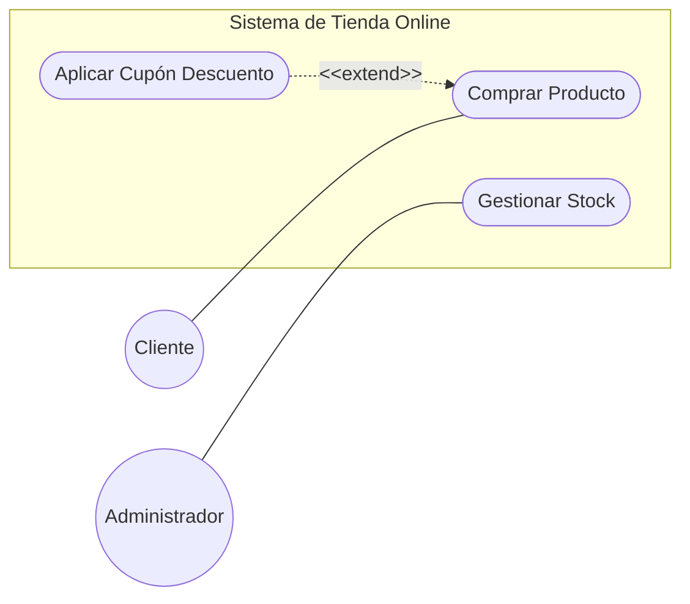
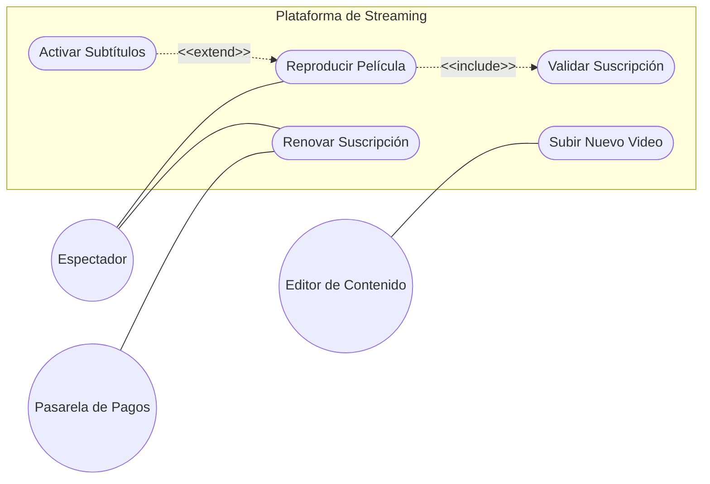

# Entornos-7.2

Ejercicio 1 

``` mermaid
graph LR
    Usuario((Usuario))

    subgraph "Sistema de Luces"
        CU1([Encender Luces])
        CU2([Apagar Luces])
    end

    Usuario --- CU1
    Usuario --- CU2

```

Ejercicio 2

```mermaid
graph LR
%% Definición de los Actores
Cliente((Cliente))
Administrador((Administrador))

subgraph "Sistema de Tienda Online"
%% Casos de Uso
CU1([Comprar Producto])
CU2([Aplicar Cupón Descuento])
CU3([Gestionar Stock])

%% Relación de Extensión (Opcional)
CU2 -.->|&lt;&lt;extend&gt;&gt;| CU1
end

%% Interacción de los actores
Cliente --- CU1
Administrador --- CU3

```

Ejercicio 3 

```mermaid
graph LR
%% Definición de los Actores
Espectador((Espectador))
Editor((Editor de Contenido))
Pasarela((Pasarela de Pagos))

subgraph "Plataforma de Streaming"
%% Casos de Uso
CU1([Reproducir Película])
CU2([Validar Suscripción])
CU3([Activar Subtítulos])
CU4([Subir Nuevo Video])
CU5([Renovar Suscripción])

%% Relación de Inclusión (Obligatoria)
CU1 -.->|&lt;&lt;include&gt;&gt;| CU2

%% Relación de Extensión
CU3 -.->|&lt;&lt;extend&gt;&gt;| CU1
end

%% Interacción de los actores
Espectador --- CU1
Espectador --- CU5
Editor --- CU4
Pasarela --- CU5

```

